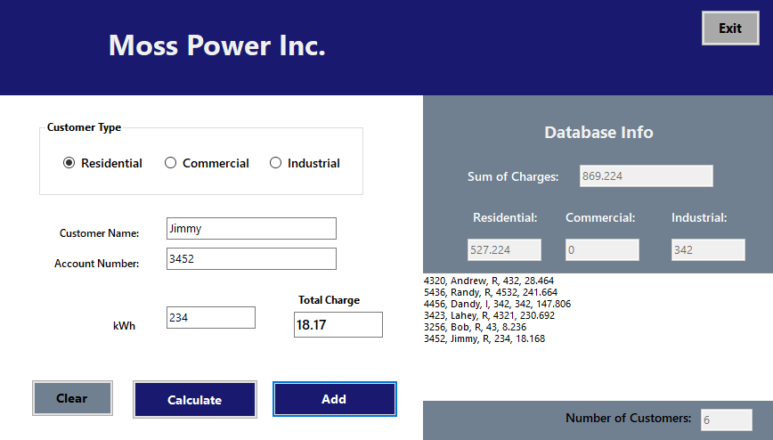

# PowerBill Calculation
>C#.NET project for a Power Company

This application was developed as a school project for a fictitious power company. 

# User Interface

## Built With

### Code
* [.NET Framework 4.6.1](https://dotnet.microsoft.com/download/dotnet-framework-runtime/net461) - Framework

## Authors

* **Andrew Moss** - *Author* - [agmoss](https://github.com/agmoss)

## License

This project is licensed under the MIT License - see the [LICENSE.md](LICENSE.md) file for details